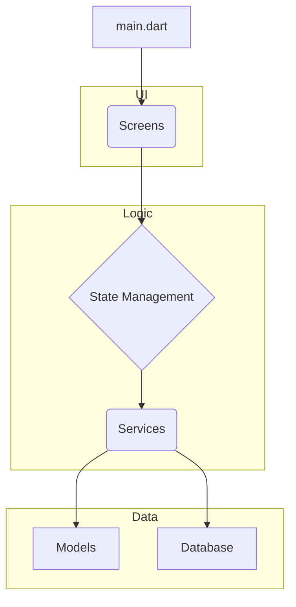

# System Patterns

## Application Structure

The application follows a standard Flutter project structure, separating concerns into different
directories.

### Key Components:

- **`main.dart`**: The application entry point.
- **`screens/`**: Contains the UI for different parts of the application (e.g., `home_screen.dart`,
  `add_project_screen.dart`).
- **`models/`**: Defines the data structures of the application, such as `Project`, `Editor`, and
  `ProjectGroup`.
- **`services/`**: Handles business logic and communication with external resources like the
  database (`database_service.dart`) and the system (`launcher_service.dart`, `path_service.dart`).
- **`utils/`**: Contains utility classes, like `logger.dart`.
- **Database**: A local SQLite database is used to persist project and editor configurations.
  `database_service.dart` abstracts the database operations.
